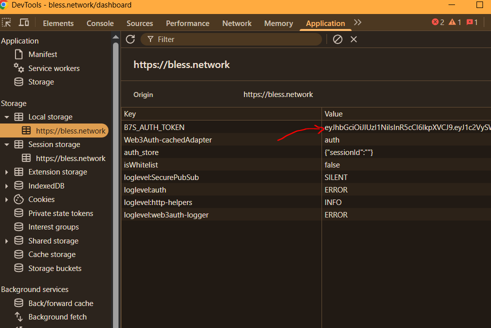
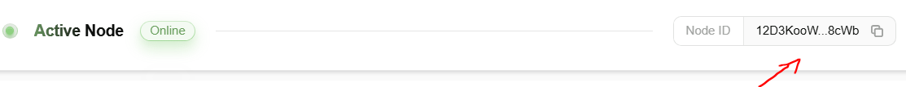
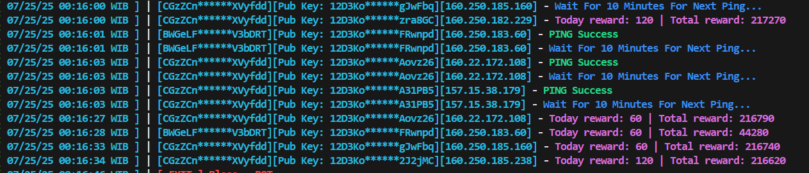

# ᝰ.ᐟ bless

Find tool here: https://amautomarket.com/products/bless-auto-mining

Tool được phát triển bởi nhóm tele Airdrop Hunter Siêu Tốc (https://t.me/airdrophuntersieutoc)

Link: [https://bless.network/dashboard](https://bless.network/dashboard?ref=4LC4UR)

## 🚨 Attention Before Running Cli Version

I am not `responsible` for the possibility of an account being `banned`!

## 📎 Node cli version Script features

✔️ Auto active session
✔️ Auto mining
✔️ Auto generate hard id
✔️ Đa luồng, đa tài khoản, đa node

===========

## Hướng dẫn: Sau khi tải về giải nén, mở terminal, yêu phiên bản python 3.7 trở lên

Chưa có python, cài tại đây: https://www.python.org/downloads/release/python-31112/

1️⃣ pip install -r requirements.txt để cài các module cần thiết.

2️⃣ Setup đầu vào:

proxy.txt lưu proxy cá nhân, định dạng proxy: http://username:password@ip:port

accounts.json lưu thông tin tài khoản đăng nhập để treo node, định dạng đã có sẵn file trong file, trong đó B7S_AUTH_TOKEN và PubKey ae lên web lấy. HardwareId (lấy theo bước 3)

Lấy B7S_AUTH_TOKEN: F12 => Tab Application => Local Storage => B7S_AUTH_TOKEN

Lấy PubKey:

3️⃣ Setup tài nguyên, chạy lệnh : python setup.py

Lệnh này sẽ tự động tạo hardware_id cho các node, ae chạy xong vào hardware_ids.txt lấy hardware_id
cập nhật vào file accounts.json

4️⃣ Chạy tool bằng lệnh :

python main.py hoặc python3 main.py

==========

⚠️ Ae lưu ý proxy tính theo nodes (không phải tính theo account, ae sử dụng bao nhiêu hardware_id thì dùng bấy nhiêu proxy)

==========
Chạy thành công (60 points/1 h/1 node)

